# Graphical Analysis of Equations of Motion

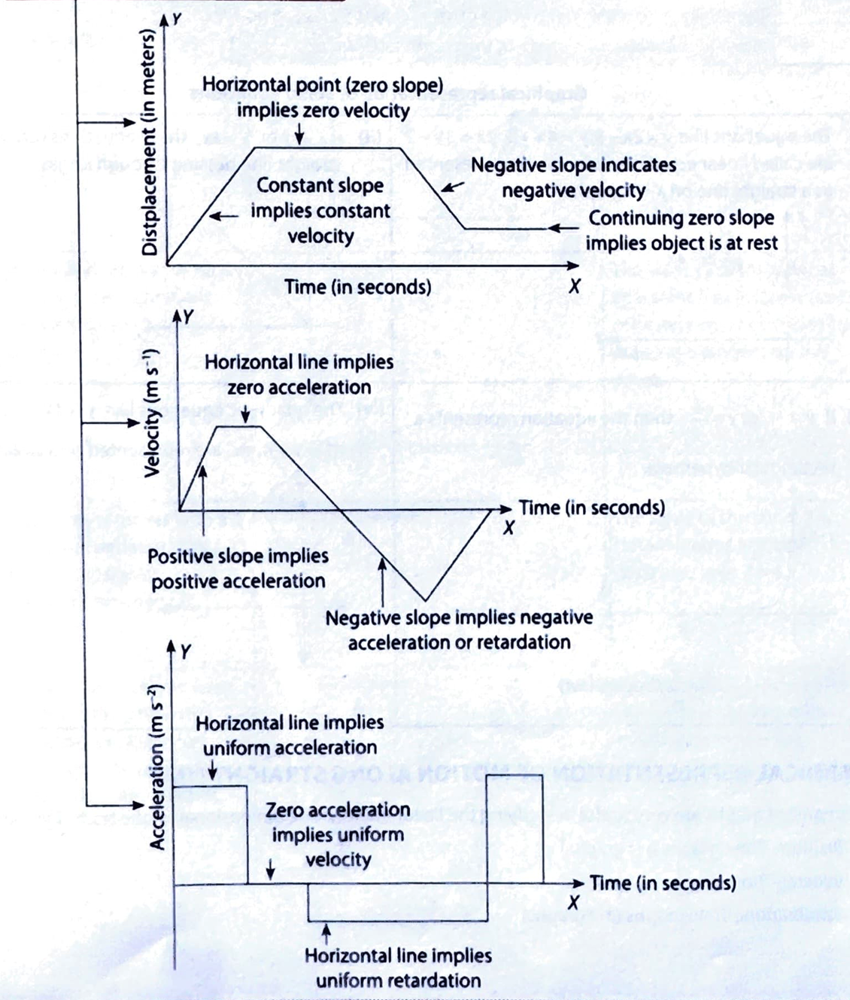
 

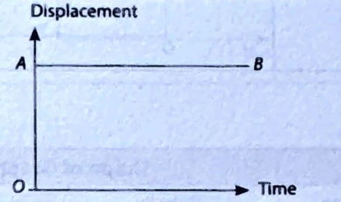

## INTRODUCTION
Graphical representation of motion is an easy method to show the variation of an independent velocity, acceleration, etc.) with an independent quantity (time). In this type of representation, time the $X$-axis, while distance or velocity, or acceleration is plotted along the $Y$-axis.

### Graphs
Graph (plane figure) is a geometrical figure which shows the variation or dependence of one quantity

#### Key point
In a coordinate plane, two perpendicular lines are drawn; out of these two, one is calles (generally horizontal line) and the other is called $Y$-axis (vertical line). The point of intery these lines is called the origin of the coordinate plane.

**Graphical representation of some equations**

1. The equations like $y=2 x-3 ; y=4 x+5 ; 2 x=3 y+2$ are called linear equations, and can be represented as a straight line on $X-Y$ graph.

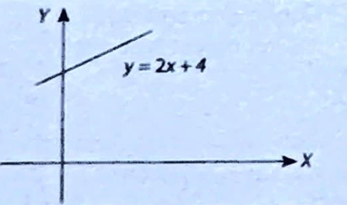

2. If $x \propto y$ or $y=k x$, these equations repep straight line passing through origin.

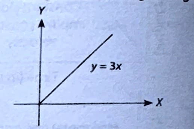

3. If $y \propto \frac{1}{x}$ or $y=\frac{k}{x}$, then the equation represents a rectangular hyperbola.

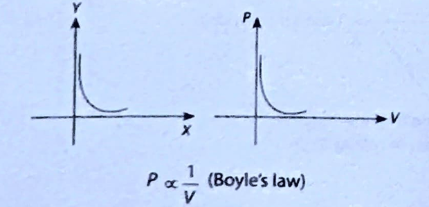 
4. The quadratic equations like $y=3 x^2+$ $x^2=y+4$,etc. are represented by a parabola

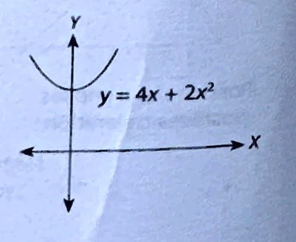

#### GRAPHICAL REPRESENTATION OF MOTION ALONG STRAIGHT LINE
Three types of graphs are very useful in studying the linear motion (one dimensional) of the body. They

1. Position-Time graphs (s-t graphs)
2. Velocity-Time graphs ( $v-t$ graphs)
3. Acceleration-Time graphs ( $a-t$ graphs)

| s. No. | Description of Motion | | Main Features of Graph| 
| :---: | :--- |:--- |:--- |
| 1. | For a stationary body, the $s-t$   graph is a straight line, $A B$,   paraliel to time axis. | | The slope of straight line $A B$  (representing instantaneous velocity) is  zero.|
| 2. | When a body moves with   a constant velocity, the)the straight line,  higher is the velocity.|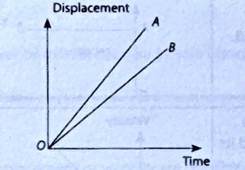|Greater the slope of the straight line,  higher is the velocity.|
| 3. | When a body moves with   constant acceleration, $s-t$   graph is a curve that bends   upward. |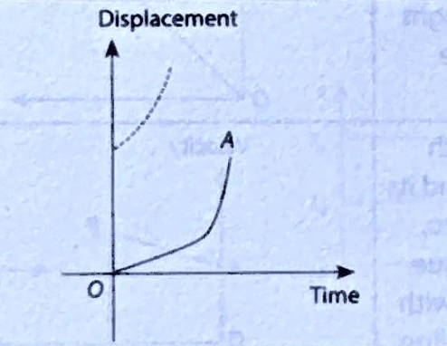| The velocity of the body at any istant   (i.e., instantaneous velocity)  can be obtained by drawing   a tangent on the curve.|
| 4. | When a body moves with a   constant retardation, the $s-t$   graph is a (parabola) curve   that bends downwards. |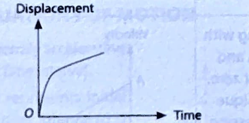| The slope of the curve (i.e., instantaneous velocity)  decreases with time.|
|5. |  When a body has a uniform   velocity with some initial   displacement, the $s-t$   is a straph   angle with horizontal axis   and has an intercept on   vertical axis. |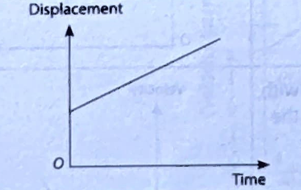| The slope of the curve gives the uniform  velocity with which body is moving.|
|6. | When a body returns to the original point of reference with   uniform velocity, the $s-t$ graph is oblique straight  line $A B$ making an angle $\theta>90^{\circ}$  with the time axis. || The displacement of the) decreases with time w.r.t to the reference point becomes zero.|

#####  Velocity-Time Graphs 

| s. No. | Description of Motion | | Main Features of Graph| 
| :---: | :--- |:--- |:--- |
| 1. | When a body moves with constant velocity,  the $v-t$ graphs is a straight line $A B$,   parallel to the time axis.| 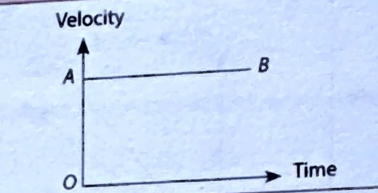| |
| 2. |When a body moves with constant acceleration   and its initial velocity is zero, the $v$ - $t$   graph is an oblique straight line passing through   the origin. | 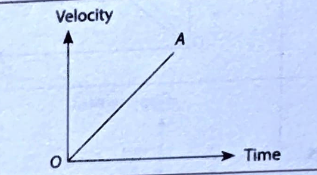| |
| 3. | When a body moves with constant acceleration and its   initial velocity is non-zero, the $v$-t graph is   an oblique (making positive angle with horizontal   axis) straight line.| 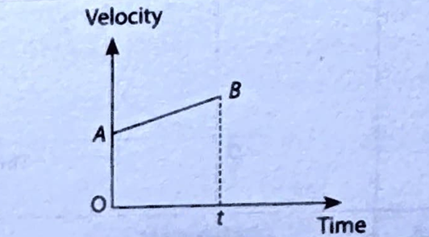| |
| 4. |When a body is moving with a constant  retardation and its initial velocity is not   zero, the $v$-t graph is an oblique straight   line $A B$, not passing through origin. | 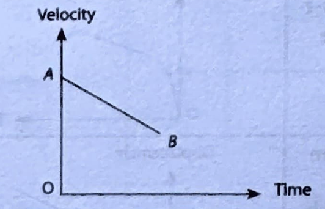| |
| 5. |When a body is moving with increasing acceleration, the $v-t$ graph is a curve that bend upwards | 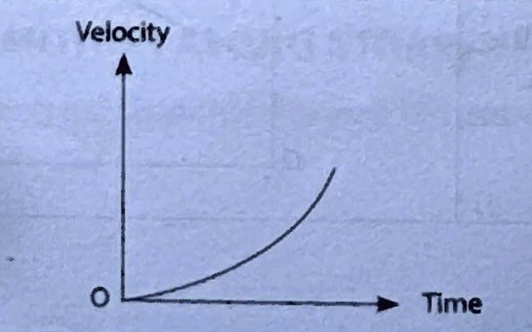| |
| 6. | When a body is moving with decreasing   acceleration, the $v$ - $t$ graph is a curve that    bends downwards.| 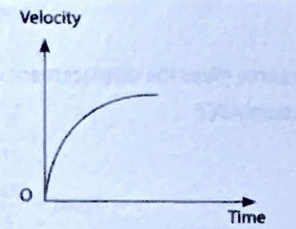| The slope of $v$ - $t$ graph (i.e.   instantaneous acceleration)   decreases with time. |

