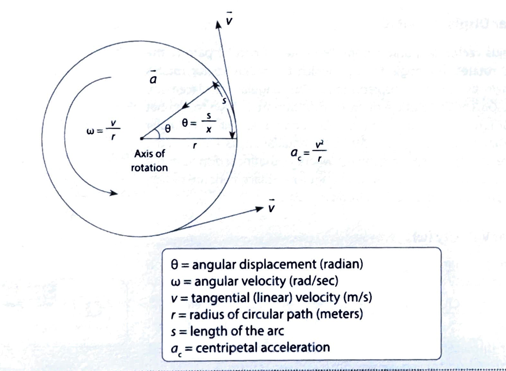
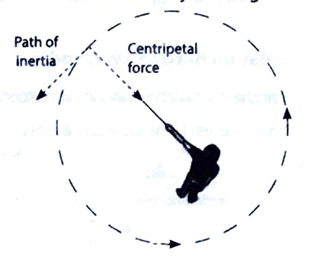
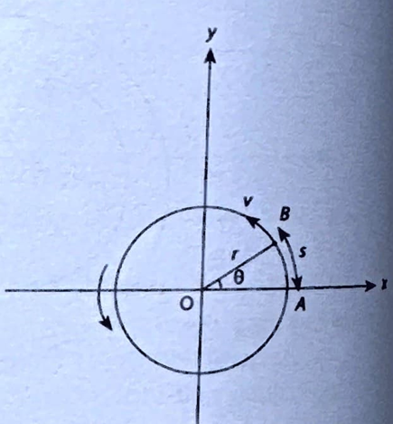

# 2.05 Uniform Circular Motion

## INTRODUCTION: CIRCULAR MOTION
Take a piece of thread and tie a small piece of stone at one of its ends. Move the stone to describe a circular path with constant speed by holding the thread at the other end, as shown in the figure. Here, the stone which is swung moves in circle. So, the stone is said to be exhibiting circular motion. A circular motion is a movement of an object along the circumference of a circle or rotation along a circular path, and the center of all these circles lies on the axis of rotation. A body undergoing circular motion can be either uniform or non-uniform.

### Uniform Circular Motion
When an object moves in a circular path at a constant speed, the object is said to be in a uniform circular motion. For example, artificial satellites orbiting the Earth have motion very near to a uniform circular motion.

Consider a rigid body undergoing uniform circular motion along a circle of radius $r$. In uniform circular motion, though the speed of the particle is constant, its linear velocity is not Because the magnitude of linear velocity is constant, but its direction is along the tangent to the circumfer the circular path. Thus, the direction of the linear velocity changes continuously. According to Newton's first particle should move along the tangent due to the inertia of direction. Instead, the particle changes its dired moves along a circular path due to a net external force acting on it. Thus, the particle undergoes displacemen the curve.
Non-uniform circular motion: When an object moves in a circular path with a variable speed, the object is sai in a non-uniform circular motion. In this chapter, we discuss uniform circular motion only.
Consider a particle moving in a circle of radius $r$ with a constant speed $v$. Let us choose the center of the circ the origin and $X Y$ plane as the plane of motion, as shown in the figure. Suppose the particle starts from $A$ on $x_i$ the particle moves along the circle, the radius vector rotates in the plane. Thus, we can define the following rot variables.

#### Angular Displacement $(\theta)$
The radius vector $\overline{O A}$, drawn from the center of circular path to the particle, rotates. The angle through which the radius vector rotates is known as angular displacement. The angular displacement, $\Delta \theta=\angle A O B$. Let the particle be at point $A$ at time $t_1$. Due to the net external force acting on it, the particle undergoes uniform circular motion and reaches $B$ at $t_2$. Let $\Delta \theta$ be the angular displacement of the radius vector. $\Delta \theta=s / r(\theta=$ arc/radius $)$, where s is the linear displacement and $r$ is the radius of circle. Units of angular displacement are radian, revolutions, rotations, and the S.I. unit is radian.

 

#### Angular Velocity ( $\omega$ )
The rate of change of angular displacement is called angular velocity. It is represented by $\omega$.
$$
\omega=\frac{\text { Change in angular position }}{\text { Time }}=\frac{\text { Angular displacement }}{\text { Time }}
$$
Key point
$2 \pi \mathrm{rad}=1 \mathrm{rev}=1$ rotatio
Angular displacement is measured in radians, and time in second. Hence, the S.I. unit of angular velocity is radian per second.
For instantaneous angular velocity, $\omega={ }_{\Delta t \rightarrow 0}^{\iota s} \frac{\Delta \theta}{\Delta t}=\frac{d \theta}{d t}$
A limit is a tool of mathematics applied for infinitesimally small changes in a variable, i.e., $\Delta t \rightarrow 0$ ( $\Delta t$ tends to zel And $\underset{\Delta t \rightarrow 0}{ } \frac{\Delta \theta}{\Delta t}=\frac{d \theta}{d t}$ where $\frac{d \theta}{d t}$ is differentiation of $\theta$ w.r.t. time taken.

Relation Between $\boldsymbol{v}, \mathbf{r}$, and $\omega$
Consider a particle moving with a constant speed $v$ along a circular path of radius $r$. Let $\theta$ be the angular displacemenl time interval $t$. The angular velocity $\omega=\frac{\theta}{t}$ and $s=A O B=$ length of the minor arc (i.e., linear displacement of the partid
$$
\begin{aligned}
\text { But } \theta & =\frac{s}{r} \\
\omega & =\frac{s}{r t}
\end{aligned}
$$
$$
\therefore \quad \omega=\frac{s}{\pi t}
$$

But linear velocity, $v=\frac{\text { Displacement }}{\text { time }}=\frac{s}{t}$
$$
\omega=\frac{v}{r} \text { or } v=r \omega
$$

#### Angular Acceleration (a)
The rate of change of angular velocity is angular acceleration. It is denoted by Greek symbol ' $a$ :'
$$
\begin{aligned}
& \text { Angular acceleration }(\mathrm{a})=\frac{\text { Change of angular velocity }}{\text { Time }} \\
& \alpha=\frac{\omega-\omega_0}{t}
\end{aligned}
$$
where $\omega \rightarrow$ final angular velocity, $\omega_0 \rightarrow$ initial angular velocity.

#### Centripetal Acceleration ( $a_c$ )
The acceleration of a body describing a circular path is called centripetal acceleration. When a body travels on a circular path, its direction constantly changes and thus its velocity changes, producing an acceleration. The acceleration is directed radially toward the center of the circle. The centripetal acceleration $a_c$ has a magnitude equal to the square of the body's speed $v$ along the curve divided by the distance $r$ from the center of the circle to the moving body; that is, $a_c=v^2 / r$. Centripetal acceleration has units of meter per second square. The force causing this acceleration is directed also toward the center of the circle and is named centripetal force.

**Key points**

Important points regarding non-uniform circular motion:
- In a non-uniform circular motion, an object moving in a circular path has varying speeds. The tangential acceleration is non-zero, the speed is changing.
Since there is a non-zero tangential acceleration, there are forces that act on an object in addition to its centripetal force. These forces include weight, normal force, and friction.
In non-uniform circular motion, normal force does not always point in the opposite direction of weight.
Resultant acceleration, $a=\sqrt{a_N^2+a_t^2}$, i.e., $a=\sqrt{(r \omega)^2+(r \alpha)^2}$
$\omega$ and $v$ both change in direction as well as magnitude.

**MISCONCEPTION**

In a uniform circular motion, an object moving in a circular path has a constant speed, uniform normal acceleration, and non-zero tangential acceleration.
FACT: In a uniform circular motion, an object moving in a circular path has a constant speed with varying normal acceleration. The tangential acceleration is zero as angular velocity is constant.

### EXAMPLES
1. A wheel is at rest. Its angular velocity increases uniformly and becomes $80 \mathrm{rad} \mathrm{s}^{-1}$ after 5 seconds. Find, angular displacement.

   Solution: $\omega_0=0, \omega_f=80 \mathrm{rad} \mathrm{s}^{-1} ; t=5 \mathrm{~s}$
$$
\theta=\left(\frac{\omega_f+\omega_0}{2}\right) t=\left(\frac{80+0}{2}\right) 5=40 \times 5=200 \mathrm{rad}
$$
2. What is the angular velocity of second's hand of a watch for one complete revolution?

   Solution: We know that second's hand completes its revolution ( $2 \pi$ ) in $60 \mathrm{sec}$.
$$
\therefore \omega=\frac{\theta}{t}=\frac{2 \pi}{60}=\frac{\pi}{30} \mathrm{rad} \mathrm{s}^{-1}
$$
3. The wheel of a car is rotating at the rate of 1200 revolutions per minute. On pressing the accelerationfor starts to rotate at 4500 revolutions per minute. Find the angular acceleration of the wheel.
   
   Solution: Angular acceleration (a) = Rate of change of angular speed
$$
=\frac{2 \pi\left(n_1-n_2\right)}{t}=2 \pi \frac{\left[\frac{4500-1200}{60}\right]}{10}=\frac{2 \pi \frac{3300}{60}}{10} \times \frac{360}{2 \pi} \frac{\text { degrees }}{\mathrm{sec}^2}=1980 \text { degree } / \mathrm{sec}^2
$$
4. A wheel completes 2000 rotations to cover $9.5 \mathrm{~km}$. Find the diameter of the wheel.
   
   Solution: Distance covered by wheel in 1 rotation $=2 \pi r=\pi D$ (where $D=2 r=$ diameter of wheel)
$\therefore$ Distance covered in 2000 rotation, $2000 \pi D=9.5 \times 10^3 \mathrm{~m}$
$$
\therefore D=1.5 \mathrm{~m}
$$
5. A wheel initially at rest is rotated with uniform angular acceleration. The wheel rotates through an angle $\theta$, first one second, and through an additional angle $\theta_2$ in the next one second. What is $\theta_2: \theta_1$ ?

   Solution: Angular displacement in first one second, $\theta_1=\frac{1}{2} \alpha(1)^2=\frac{\alpha}{2}$
$\left[\right.$ From $\left.\theta=\omega_1 t+\frac{1}{2} \alpha t^2\right]$
Now again, we will consider the motion from the rest, and angular displacement in total 2 seconds, $\theta_1+\theta_2=\frac{1}{2} \alpha(2)^2=2 \alpha$
Solving (i) and (ii), we get
$$
\begin{aligned}
& \theta_1=\frac{\alpha}{2} \text { and } \theta_2=\frac{3 \alpha}{2} \\
& \theta_2: \theta_1=3: 1
\end{aligned}
$$

### RECALL
1. A circular motion is a movement of an object along the circumference of a circle or rotation along a path.
2. When an object moves in a circular path at constant speed, the object is said to be in uniform circular motion
3. When an object move in a circular path with a variable speed, the object is said to be in non-uniform circular motion.
4. The angle through which the radius vector rotates is known as angular displacement. Units of angular displacement are radian, revolutions, rotations, and S.I. unit is radian.
5. The rate of change of angular displacement is called angular velocity.
6. $2 \pi \mathrm{rad}=1 \mathrm{rev}=1$ rotation
7. Relation between $v, r$, and $\omega: \omega=\frac{v}{r}$ or $v=r \omega$
8. The rate of change of angular velocity is angular acceleration.
9. Resultant acceleration, $a=\sqrt{a_N^2+a_t^2}$, i.e., $a=\sqrt{(r \omega)^2+(r \alpha)^2}$

### DESCRIPTIVE QUESTIONS

#### I. VERY SHORT ANSWER QUESTIONS
1. Define uniform circular motion.
2. Give two examples of uniform circular motion.
3. What is the direction of velocity vector of a particle in a circular motion?
4. Is it possible to accelerate a body if its speed is constant?
5. If circular motion of the object is uniform, then what type of acceleration does it posses?
6. Define angular displacement.
7. Define angular velocity.
8. Give the relation between revolution and radian.
#### II. SHORT ANSWER QUESTIONS
9. Derive the relation $v=r \omega$.
10. Express centripetal acceleration in terms of time of revolution.
11. A stone tied to the end of a string of $40 \mathrm{~cm}$ long whirled in horizontal circle with constant speed. If the stone makes 14 revolutions in 25 seconds, what is the magnitude and direction of the acceleration of the stone?
#### III. LONG ANSWER QUESTIONS
12. Convert the following:
(i) RPM to RPS
(ii) RPM to radians per second
(iii) Radians to revolution
13. Give five characteristics of uniform circular motion.
#### IV. FILL IN THE BLANKS
14. A $\qquad$ is a movement of an object along the circumference of a circle or rotation along a circular path, and the center of all these circles lies on the axis of rotation.
15. A body undergoing circular motion can be either
$\qquad$ or $\qquad$ .
16. $\qquad$ is measured in radian.
17. The rate of change of angular displacement is called $\qquad$
18. Angular velocity is measured in $\qquad$ .
19. The rate of change of angular velocity is called
$\qquad$ .
20. Direction of angular acceleration is $\qquad$ as that of change in angular velocity.
21. Angular acceleration is measured in $\qquad$
22. If $\theta$ is the angular displacement, the number of rotations completed $\qquad$ ..
23. Angular velocity of second's hand is $\qquad$ .
#### V. TRUE OR FALSE
24. Uniform circular motion is a periodic motion having a definite time and frequency.
25. The unit of angular velocity is rad $\mathrm{s}^{-1}$.
26. The unit of angular displacement is $\mathrm{s}^{-1}$.
27. In uniform circular motion, linear velocity is constant.
28. The angular acceleration is always directed along the radius of the circle and towards its center.