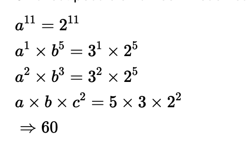

1. Ascending order of $\sqrt{3}, \sqrt[3]{4}, \sqrt[6]{12}$ is
    * a) $\sqrt{3}, \sqrt[3]{4}, \sqrt[6]{12}$
    * b) $\sqrt[6]{12}, \sqrt[3]{4}, \sqrt{3}$
    * c) $\sqrt[3]{4}, \sqrt{3}, \sqrt[6]{12}$
    * d)none of these

    Solution:

    $\sqrt{3}$ = 1.732 \
    $\sqrt[3]{4}$ = 1.58 \
    $\sqrt[6]{12}$ = 1.51

2. What is the units digit of $(123)^{(123)}$
    * a) 3
    * b) 6
    * c) 7
    * d) 9

   Solution.

   $(123)^{(123)} {\displaystyle \equiv }$ $(3)^{(123)}$ = $(3)^{(100+23)}$

   As $3^{4}$ = 81 ${\displaystyle \equiv }$ 1

   $(3^{4})^{25} {\displaystyle \equiv} $ 1

   $(3)^{(100+23)}$ = $1*3^{23}$ = $3^{20+3}$ = 1*$3^3$ = 27

   Hence last digit is 7
    References = https://www.doubtnut.com/qna/3639143

3. If $x=(1!+2!+3!+4!\ldots \ldots \ldots . .+100!)$, what is the remainder when $x$ is divided by 3

    * a) 1
    * b) 2
    * c) 0
    * d) none of these

    Solution: c

    Notice that all the terms from 3 ! to 100 ! inclusive have 3 as a factor, so $3!+\ldots+100$ ! is a multiple of 3 .

    Notice that $1!+2!=1+2=3$ which is a multiple of 3, which when divided will give remainder of 0

4. $\sqrt{7-2 \sqrt{10}}=$

    * a) $\sqrt{5}+\sqrt{2}$
    * b) $\sqrt{2}-\sqrt{5}$
    * c) $\sqrt{5}-\sqrt{2}$
    * d) none of these

    Solution : c

    It can be written as $\sqrt{5+2-2 \sqrt{5}*\sqrt{2}}= \sqrt{(5-2)^2}$ \
    Which is $\sqrt{5}-\sqrt{2}$

5. 
   
$$
\sqrt{6+2 \sqrt{2}+2 \sqrt{3}+2 \sqrt{6}}=
$$

  * a) $\sqrt{2}+1+\sqrt{3}$
  * b) $\sqrt{2}+\sqrt{6}+\sqrt{3}$
  * c) $\sqrt{2}+\sqrt{3}-1$
  * d) none of these

  Solution.

  $\sqrt{1+(\sqrt{3})^2+(\sqrt{2})^2+2(\sqrt{3} \times 1+\sqrt{3}} = \sqrt{(\sqrt{3} \times 1+\sqrt{2})^2}$

  Hence answer is a

6. Rationalizing factor of $\sqrt{108}$
   * a) $\sqrt{2}$
    * b) $\sqrt{3}$
    * c) $\sqrt[3]{2}$
    * d) $\sqrt{4}$

    Solution.

    $\sqrt{108} = \sqrt{2 \cdot 2 \cdot 3^2 \cdot 3}= 2 \cdot 3 \sqrt{3} $ 

    Hence $\sqrt{3}$ is the rationalizing factor.

7. $3 . \overline{14}=$
    * a) $\frac{311}{90}$
    * b) $\frac{311}{99}$
    * c) $\frac{314}{100}$
    * d) $\frac{314}{99}$

    Solution: b

8. $\frac{\sqrt{3}-1}{\sqrt{3}+1}=a+b \sqrt{3}, a+b=$

9. If $|X|=5$, then $X=$ $\qquad$
    * a) 5
    * b) -5
    * c) 0
    * d) Both a and b

    Solution. d

10. Number of Factors of 120
    * a) 12
    * b) 16
    * c) 10
    * d) 15

    Solution. 120 = 4x30 = 4 x 6 x 5 = $2^3 \times 3  \times 5$

    120 is a composite number so it has more then two factors unlike a prime number which has only two factors i.e, 1 and the number itself.

    But 120 can be expressed in terms of its prime factors as $120=2 \times 2 \times 2 \times 3 \times 5$

    The above 5 prime factors it has other factors too The same can be calculated by:

    Numbers of factors=Each prime factors highest power 1 multiplied by each of the other factors highest power +1 .
    so, here highest power of 2,3 and is ' 3 '. '1' and '1' respectively.

    Therefore, $120(3+1) \times(1+1) \times(1+1)=16$ factors.

11. What is the least number which is having 12 factors
    * a) 36
    * b) 48
    * c) 60
    * d) 72

    Solution. 
    Concept Used:
    $N=a^p \times b^q \times c^r$ Where $a, b$ and $c$ are prime factors of $N$.
    Number of factors of $N=(p+1) \times(q+1) \times(r+1)$
    
    Calculation:

    12 can be written as $1 \times 12$ or $2 \times 6$ or $3 \times 4$ or $2 \times 2 \times 3$
    Underlying prime factorization can be of the form $\mathrm{a}^{\mathrm{p}} \Rightarrow \mathrm{a}^{11}$
    Underlying prime factorization can be of the form $a^p \times b^q \Rightarrow a^1 \times b^5$ or $a^2 \times b^3$
    Underlying prime factorization can be of the form $a^p \times b^q \times c^r \Rightarrow a \times b \times c^2$
    
    Smallest possible number in each case

    

    The smallest of four cases is $5 \times 3 \times 2^2$
    $\therefore 60$ is the smallest number that has exactly 12 factors

12. If $|x|+|y|=0$, then
    * a) $x=0$
    * b) $y=0$
    * c) a or b
    * d)a and b

   Solution: d

13. 

$$
\sqrt{\sqrt{\sqrt{\sqrt{\sqrt{\sqrt{2}}}}}}=
$$
* a) $2^{\frac{1}{32}}$
* b) $2^{\frac{1}{64}}$
* c) $2^{\frac{1}{16}}$
* d) $2^{\frac{1}{128}}$

  Solution. b

14. HCF ofA, $B$ and $C$ is where $A=2^5 \times 3^3 \times 5^7, B=3^2 \times 5^7 \times 7^5, C=3^3 \times 5^5 \times 7^7 \times 11^{11}$
    * a) $3^2 \times 5^5$
    * b) $3^2 \times 5^3 \times 7$
    * c) $3^2 \times 5^3$
    * d) $3^2 \times 5^3 \times 7^2$

Solution : a

15. 
    
$$
\frac{a-2 \sqrt{a b}+b}{\sqrt{a}-\sqrt{b}}=
$$
   * a) 1
   * b) $a-b$
   * c) $a+b$
   * d) 0

   Solution. a

16. The sum of factors of 36
    * a) 91
    * b) 45
    * c) 60
    * d) 90

    Solution. a
    The sum of all the factors of 36 can be calculated by adding 1, 2, 3, 4, 6, 9, 12, 18, 36 which is 1 + 2 + 3 + 4 + 6 + 9 + 12 + 18 + 36 = 91

17. Units digit of $2^{50} \times 15^{35}$
    * a) 5
    * b) 2
    * c) 1
    * d) 0

  Solution. d